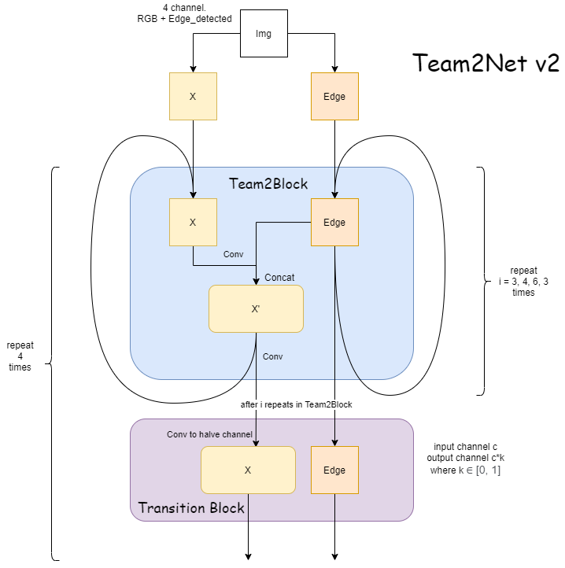

# MATH499 Final Project Team2


> This is a final deliverable for LookDeep Inc that determines huaman posture in a medical setting through convolution.

---

### Table of Contents
You're sections headers will be used to reference location of destination.

- [Description](#description)
- [How To Use](#how-to-use)
- [References](#references)
- [Contributors](#Contributors)

---

## Description

This project uses various CNN architectures and trains on over 40000 medical images provided by LookDeep Inc. The goal of this project is to determine whether the person of interest is either 

1.  Standing, 
2.  Sitting,
3.  or, Lying. 

#### Architectures

The CNN architectures we used in this project is listed as follows:

- MobileNet 

- EfficientNetB0 

- Team2Net

    We borrow the intuition of ResNet in our Team2Net v1.
    
    Instead of F(x) + x in ResNet we have F(x) + edge_detected(x) for skip connection. 
    
    
    
    And we make the skip connection *dense* in Team2Net v2.
    
    


### Data Augmentation

In this project we use the data augmentation library `Albumentation`.

Our data augmentation is 

```python
AUGMENTATIONS = A.Compose([
    A.Rotate(limit=40),
    A.OneOf([
        A.RandomBrightnessContrast(brightness_limit=0.3, contrast_limit=0.3),
        A.RandomBrightnessContrast(brightness_limit=0.1, contrast_limit=0.1)
    ]),
    A.OneOf([
        A.ElasticTransform(alpha=224, sigma=224 * 0.05, alpha_affine=224 * 0.03),
        A.GridDistortion(),
        A.OpticalDistortion(distort_limit=2, shift_limit=0.5),
    ], p=0.3),
    A.HueSaturationValue(hue_shift_limit=20, sat_shift_limit=30, val_shift_limit=20, p=0.5),
    A.RandomContrast(limit=0.2, p=0.5),
    A.HorizontalFlip(),
    A.ShiftScaleRotate(shift_limit=0.05, scale_limit=0.1, rotate_limit=10),
])
```

During the training process we also add `Random_eraser`.

The training takes 9.25 s per batch;

and testing (without our `random_eraser` implementation) takes 8.65s per batch.

---

## How To Use

The execution of this code requires the change of `label_dir`, `img_dir`, and `save_dir` in `config.py`.
- label_dir: the directory that contains the labeling csv files
- img_dir: the directory that contains all of the testing images, where images from tranch t must be in subfolder img_dir/tranch<t> and images for all tranchs must be in subfolder img_dir/allTranch.
- save_dir: the directory used to save model checkpoints in save_dir/<tranch>/<model type>-<ensemble num>.<epoch>-<val acc>.h5
  

Then, to execute, run train.py.

#### Installation

Required Packages: 
- `tensorflow 2.3` 

- `albumentation`

- [`imagedataaugmenter`](https://github.com/mjkvaak/ImageDataAugmentor) 

  Fork of Keras image data generator which supports the 3rd party data augmentation modules
  
  ---

## References

- Buslaev, A., Parinov, A., Khvedchenya, E., Iglovikov, V., & Kalinin, A. (2018, September 18). Albumentations: Fast and flexible image augmentations. Retrieved November 12, 2020, from https://arxiv.org/abs/1809.06839

- He, K., Zhang, X., Ren, S., & Sun, J. (2015, December 10). Deep Residual Learning for Image Recognition. Retrieved November 12, 2020, from https://arxiv.org/abs/1512.03385

- Huang, G., Liu, Z., Van der Maaten, L., & Weinberger, K. (2018, January 28). Densely Connected Convolutional Networks. Retrieved November 12, 2020, from https://arxiv.org/abs/1608.06993

- Sandler, M., Howard, A., Zhu, M., Zhmoginov, A., & Chen, L. (2019, March 21). MobileNetV2: Inverted Residuals and Linear Bottlenecks. Retrieved November 12, 2020, from https://arxiv.org/abs/1801.04381

- Tan, M., & Le, Q. (2020, September 11). EfficientNet: Rethinking Model Scaling for Convolutional Neural Networks. Retrieved November 12, 2020, from https://arxiv.org/abs/1905.11946

- Zhong, Z., Zheng, L., Kang, G., Li, S., & Yang, Y. (2017, November 16). Random Erasing Data Augmentation. Retrieved November 12, 2020, from https://arxiv.org/abs/1708.04896

---

## Contributors

- Daniel Chaderjian, Jiashu Xu, Phillip Bliss, Sydney Yu, Terry Lu

---

## Full Documentation

- [MATH499 Final Project Team2](
https://docs.google.com/document/d/1N6RLE5okG_bNiMLmLjJ2Q8FPSLULe9cCZVQr0_sJsGw/edit?usp=sharing)

